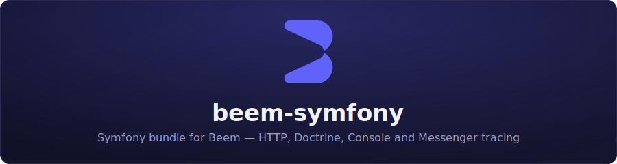

<p align="center">
  
</p>

<p align="center">
  <a href="https://github.com/beemlabs/beem-symfony/actions/workflows/ci.yml"></a>
  <a href="https://packagist.org/packages/beemlabs/beem-symfony"></a>
  <a href="https://packagist.org/packages/beemlabs/beem-symfony"></a>
  <a href="LICENSE"></a>
</p>

Symfony 6.4/7 bundle for the [Beem](https://github.com/beemlabs) SDK — auto-traces HTTP requests, Doctrine queries, console commands, and Messenger messages, and captures unhandled exceptions.

## Requirements

- PHP 8.2+
- Symfony 6.4 or 7
- [`beemlabs/beem-php`](https://github.com/beemlabs/beem-php) (installed automatically)

## Installation

```bash
composer require beemlabs/beem-symfony
```

Register the bundle (skip if Flex does it for you):

```php
// config/bundles.php
return [
    // ...
    Beem\SymfonyBundle\BeemSymfonyBundle::class => ['all' => true],
];
```

Configure the DSN:

```yaml
# config/packages/beem.yaml
beem:
    dsn: '%env(BEEM_DSN)%'
```

## Configuration

Full reference with defaults:

```yaml
beem:
    dsn: '%env(BEEM_DSN)%'   # required; empty disables the SDK
    sample_rate: 1.0          # 0.0–1.0
    max_batch_size: 500
    flush_timeout_ms: 2000
    environment: null         # defaults to kernel.environment
    release: null
    default_tags: {}
    instrument_doctrine: true
    instrument_console: true
    instrument_messenger: true
```

## What gets traced

- **HTTP** — one transaction per request, named after the route, with the response status.
- **Doctrine** — SQL queries become `db.query` spans via a DBAL middleware/logger.
- **Console** — each command runs in its own transaction.
- **Messenger** — each handled message runs in its own transaction.
- **Exceptions** — unhandled exceptions are captured and linked to the active transaction.

Manual instrumentation is available through the core SDK's `Beem\Beem` facade — see the [beem-php README](https://github.com/beemlabs/beem-php).

## Development

```bash
composer install
composer test      # Pest
composer cs:check  # php-cs-fixer (dry-run)
composer cs:fix    # php-cs-fixer
```

This repository is a read-only split of the [Beem monorepo](https://github.com/beemlabs). Please open issues and pull requests there — direct pushes here are overwritten by the next sync.

## License

MIT
